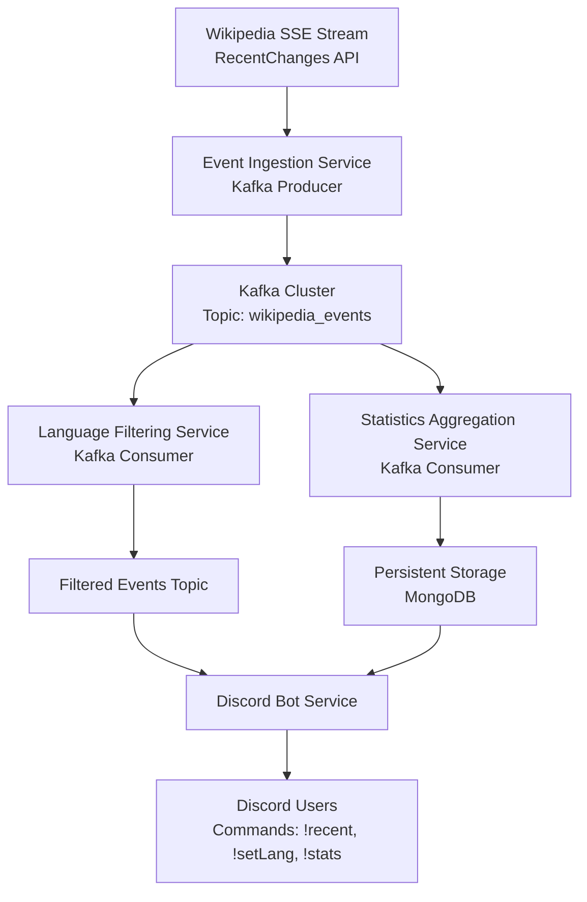

## Data Flow

1.  **Wikipedia Event Ingestion**

    -   **Source:**  
        Connects to the Wikipedia SSE stream (RecentChanges API) to receive a continuous flow of events.
    -   **Process:**
        -   The **Event Ingestion Service** reads events via SSE.
        -   It performs basic validation and, if needed, enriches the event data.
        -   Each event is serialized into JSON and published to the Kafka topic `wikipedia_events`.
    -   **Output:**  
        Raw event messages are now available in Kafka for downstream processing.
2.  **Kafka Cluster**

    -   **Role:**  
        Acts as the central message bus to decouple the ingestion, processing, and presentation layers.
    -   **Topics:**
        -   **wikipedia_events:** Contains all ingested raw events.
        -   **filtered_events (Optional):** May store events that have passed through language filtering.
3.  **Language Filtering Service**

    -   **Input:**  
        Subscribes to the `wikipedia_events` topic.
    -   **Process:**
        -   Applies language filtering based on user-defined or default criteria (e.g., English events only).
        -   Optionally republishes the filtered events to a dedicated Kafka topic (`filtered_events`).
    -   **Output:**  
        Filtered events are made available for immediate consumption by downstream services or cached for quick access.
4.  **Statistics Aggregation Service**

    -   **Input:**  
        Consumes events from either `wikipedia_events` or the `filtered_events` topic.
    -   **Process:**
        -   Aggregates event statistics, such as counting the number of changes per day for each language.
        -   Updates and stores these aggregated statistics in persistent storage (Redis, MongoDB, or PostgreSQL).
    -   **Output:**  
        A real-time record of daily event counts per language that can be queried by other components.
5.  **Discord Bot Service**

    -   **Input:**
        -   Retrieves the latest events (directly from Kafka or an in-memory cache maintained by the filtering service).
        -   Queries the persistent storage for daily statistics.
    -   **Process:**
        -   Listens for Discord commands, such as:
            -   `!recent`: Displays the most recent Wikipedia changes.
            -   `!setLang [language_code]`: Updates the user or server language preference.
            -   `!stats [yyyy-mm-dd]`: Returns the aggregated statistics for the specified date.
    -   **Output:**  
        Sends formatted responses back to users on Discord, providing real-time event updates and statistics.
6.  **User Interaction**

    -   **Source:**  
        Discord users interact with the bot by issuing commands.
    -   **Process:**
        -   The Discord Bot Service processes these commands, fetches data from Kafka or the database, and composes responses.
    -   **Output:**  
        Users receive real-time updates and statistics via Discord messages.
 receive real-time updates and statistics via Discord messages.

